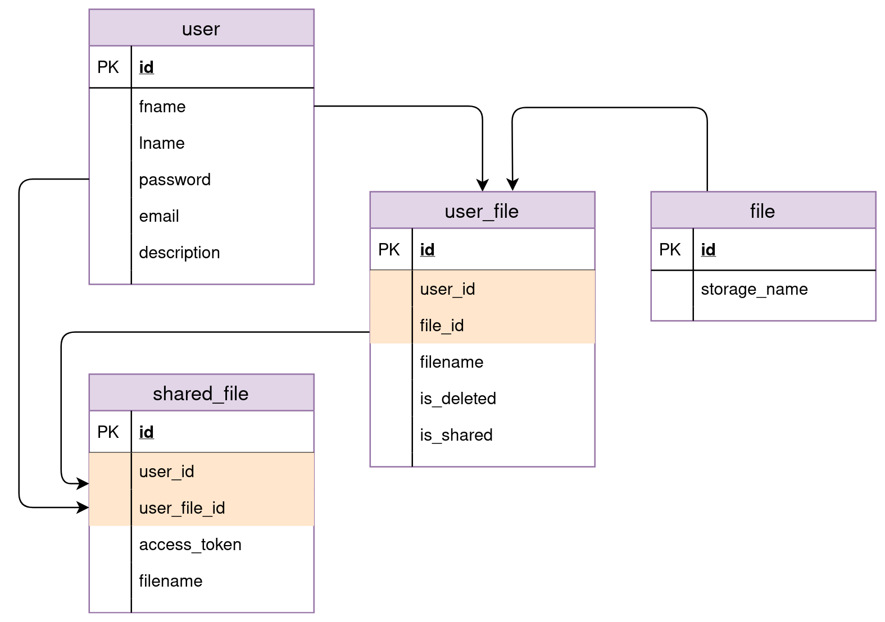

# A simple flask app

## What's the purpose of this app ?

Offer a simple way to manage files, upload, download, delete and share.

## What this app do ?

Allow users to upload, download, delete and share thier files.

## relational diagram




## email/password table

| email          | password |
|----------------|----------|
| a@a.com        | ''       |
| b@a.com        | 123      |
| abcde@a.com    | ''       |
| admin@root.com | 123      |
| a@b.com        | 12345    |

## how to run this app?
python >= 3.7

change the config.DB to your config, create a database named flask_app for your app.

run as a new app(make sure requirements.txt is in the current directory):
```shell
$ pip install virtualenv

$ cd my_project_dir

$ virtualenv venv

$ source venv/bin/activate

$ pip install -r requirements.txt

$ mysql -u yourusername -p

MYSQL [flask_app]> source data.sql;

$ python main.py
```

run with records,unzip the local zip file:
```shell
$ cd my_unzip_project_dir

$ source venv/bin/activate

$ python main.py
```